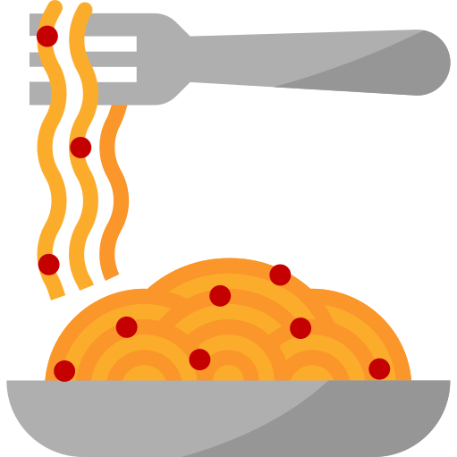

# PASTA-ELN | The favorite ELN for experimental scientists

PASTA-ELN provides a streamlined and locally installed electronic labnotebook (ELN) for experimental scientists to efficiently organize raw data and associated metadata.

The documentation is located at [Github-pages](https://pasta-eln.github.io/pasta-eln/)
