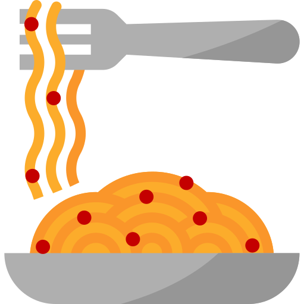

[](https://badge.fury.io/py/pasta-eln)
[](https://badge.fury.io/gh/PASTA-ELN%2Fpasta-eln)
[](https://github.com/PASTA-ELN/pasta-eln/actions/workflows/pypi.yml)
[](https://github.com/PASTA-ELN/pasta-eln/actions/workflows/installLinux.yml)
[](https://github.com/PASTA-ELN/pasta-eln/actions/workflows/docbuild.yml)
[](https://github.com/PASTA-ELN/pasta-eln/actions/workflows/pylint.yml)
[](https://github.com/PASTA-ELN/pasta-eln/actions/workflows/mypy.yml)

# PASTA-ELN



PASTA-ELN is a local electronic lab notebook for experimental scientists. It organizes raw data, metadata, projects, and associated files in a desktop application built with Python and PySide6.

The full user and developer documentation is available at [PASTA-ELN documentation](https://pasta-eln.github.io/pasta-eln/).

## Quick start

PASTA-ELN supports Python 3.10 and later.

```bash
pip install -r requirements-linux.txt  # or requirements-windows.txt
pip install -e .
python -m pasta_eln.gui
```

For development tools, install `requirements-devel.txt`. Run the following commands from the repository root:

```bash
QT_QPA_PLATFORM=offscreen python -m pytest tests/
python -m mypy pasta_eln
python -m pylint pasta_eln
```

Build the documentation with `make -C docs html`.

For maintainer release work, `releaseVersion.py` provides a broader verification run; invoke it manually only.

## Open issues

Open issues are the union of:

- [GitHub Issues](https://github.com/PASTA-ELN/pasta-eln/issues), which tracks actionable bugs, enhancements, and discussion; and
- this README section, which records repository-wide maintenance items that need visibility before or alongside an issue.

### Repository maintenance items

- Continue GUI transition for all modal dialogs
- F12 does not seem to work
- Clean up
  - rerun code quality skill once-a-while
  - Find unused code
  - functions that are similar in scope
- Persistence safety
  - Replace SQL f-strings in SQLite persistence code with parameterized queries; quoted document values can currently break saves and imported values must not alter queries.
  - Make ELN imports fail atomically and report failure when adding a document fails; the current recovery path can continue after an add failure and report a partial import as successful.
