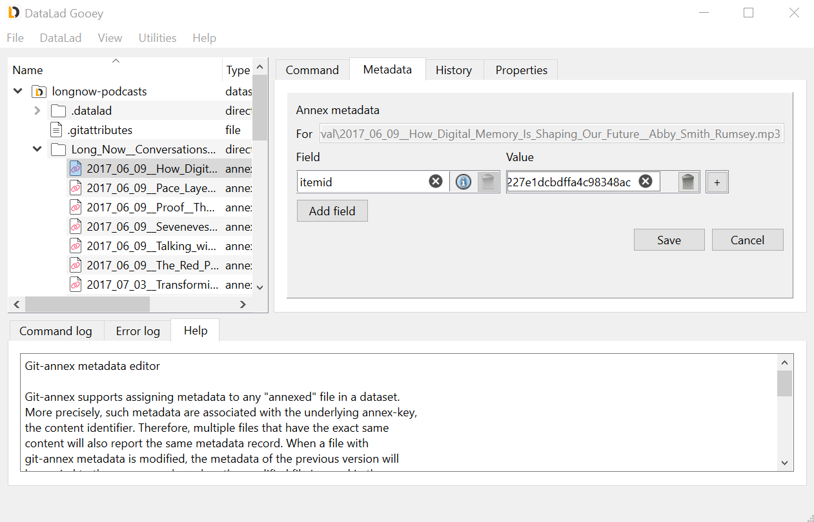
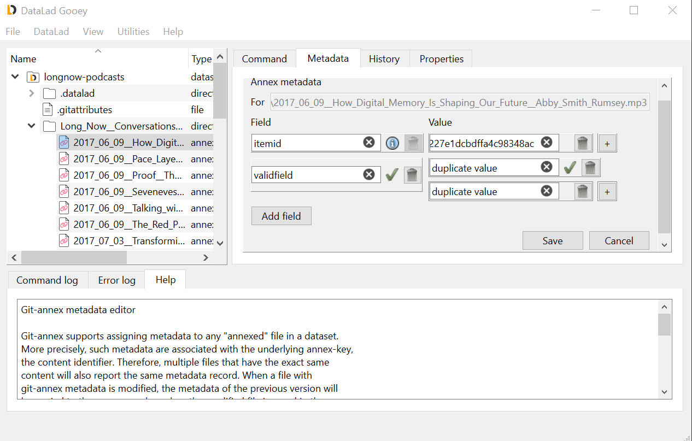

.. _annexmeta:

Setting git-annex metadata
^^^^^^^^^^^^^^^^^^^^^^^^^^

:term:`git-annex` has its own concept and implementation of file metadata, and DataLad Gooey provides a graphical user interface for querying, removing, and setting metadata.
This functionality is exposed via the ``Metadata`` tab or right-click context menue on any annexed file.

Each annexed file's content [#f1]_ can have any number of metadata *fields* attached to it to describe it, and each field can have any number of *values*.
This metadata is stored internally, in the :term:`git-annex branch`.

The Annex metadata editor will show all existing fields and values for a selected file, and let users add additional fields and values as well as deleting them.
A subsequent ``Save`` will write the provided annex metadata to the file.

Input validation
----------------

git-annex's metadata is highly flexible and allows arbitrary content, but it is impossible to have two fields of the same name, or two identical values belonging to one field.
This is validated automatically after each entry, and only valid metadata can be saved.
Icons attached to conflicting fields will let you know which metadata elements need fixing.

.. [#f1] Note that metadata is attached to file content, not file names, i.e. the git-annex key corresponding to the content of a file, not to a particular filename on a particular git branch. This means that all files with the same key share the same metadata, which is stored in the :term:`git-annex branch`. If a file is modified, the metadata of the previous version will be copied to the new key when git-annex adds the modified file.