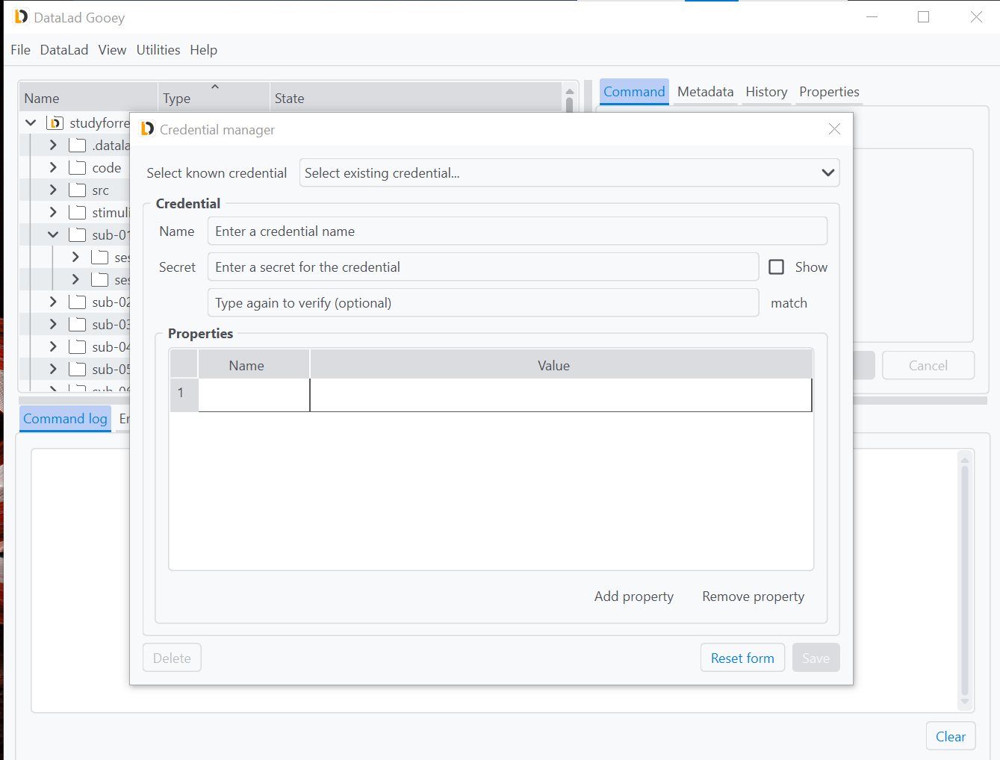
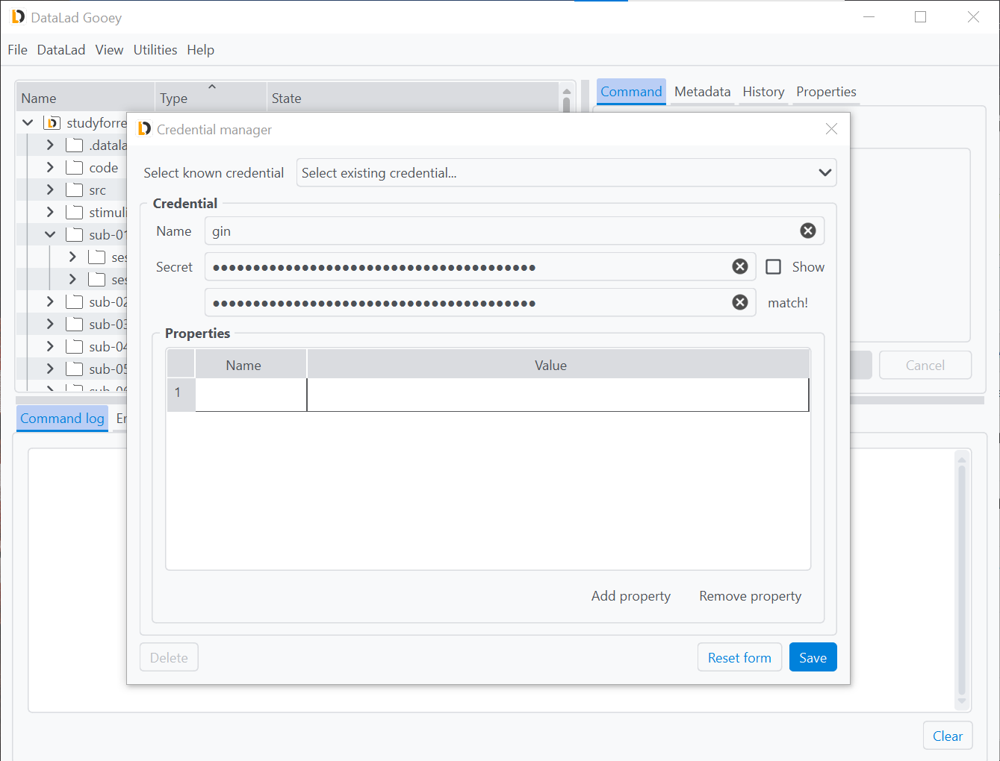
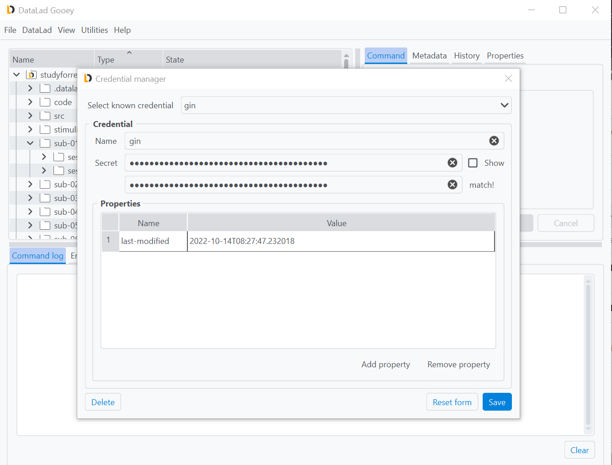
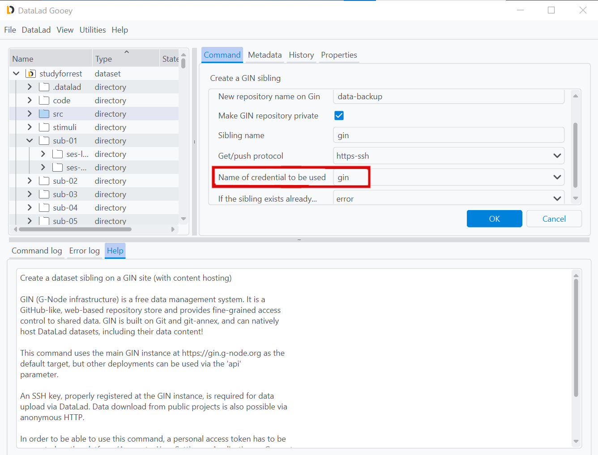

.. _credentials:

Credential management with DataLad Gooey
^^^^^^^^^^^^^^^^^^^^^^^^^^^^^^^^^^^^^^^^

DataLad can store credentials and use them to authenticate against a variety of services or infrastructures.
Among them are, for example, the credentials required to push datasets to siblings on Gin, GitHub, or similar services.
``DataLad Gooey``'s credential manager makes setting, querying, and removing credentials much easier than performing the actions via the command line.
It is a front-end for the modernized `datalad credential <http://docs.datalad.org/projects/next/en/latest/generated/man/datalad-credentials.html>`_ command from `datalad-next <http://docs.datalad.org/projects/next/en/latest>`_.

Access to this tooling is provided via the ``Utilities`` -> ``Manage credential`` menu in the tab bar.

All credentials are identified via a unique name, and should at least contain a secret such as a token, a password, or a key.
The ``Select known credential`` drop-down menu will list all known secrets for query or modification.
This drop-down menu can be helpful to discover credentials, update them after their secrets changed, or remove credentials that became obsolete via the ``Delete`` button at the bottom of the form.

In order to create a new credential, for example a token to authenticate against :ref:`Gin <gin>`, enter a name of your choice (here it is ``gin``) and a corresponding secret in the ``Credential`` tab underneath.
As the ``Secret`` field is confidential, the characters you type or paste will be hidden, but the ``show`` button on the right can be ticked to view it in clear text.
To prevent typos, the secret has to be repeated and match the previous entry.
The ``Save`` button at the bottom will store the secret in your systems credential store.

Credentials can have properties denoting additional details about them useful for queries or required for authentication to particular services.
Once saved, the ``gin`` credential gained an automatic property, the ``last-modified`` property.
You can add additional arbitrary properties or alter or remove existing ones in the central ``Properties`` tab.

Once saved, the credential will be available in all commands with a credential parameter via a drop-down menu for you to select.
This ensures that you can precisely select which credential is used in every operation.
Especially if you have several accounts on one and the same service or several authentication methods with a different set of permissions, such as one for your private account and one for your organizations account, this comes in handy.

In the screenshot below, the newly created credential ``gin`` is used in the parametrization of a ``create-sibling-gin`` command.

