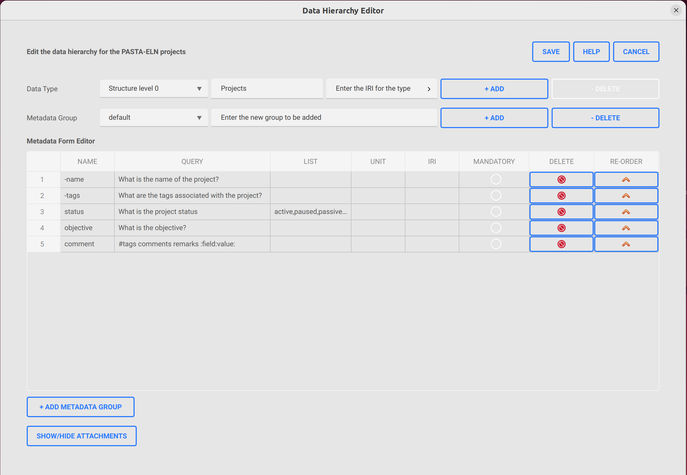
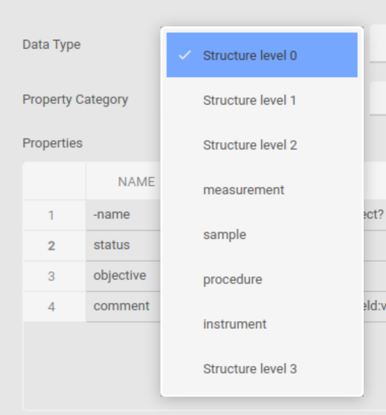
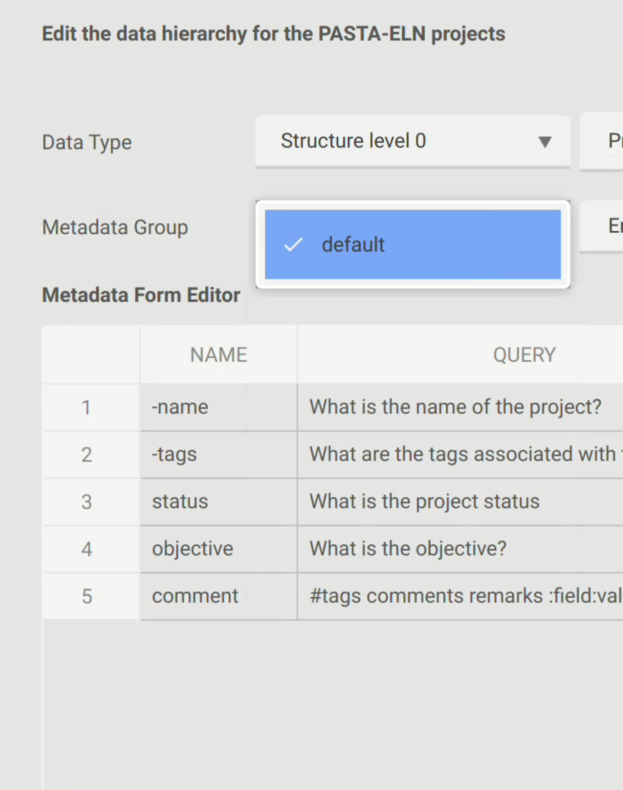

.. _definitions:

Definitions
***********

Data Hierarchy Configuration
============================

Data hierarchy editor tool allows the user to adapt the existing data types in the database used by PASTA Application.
User can enter/edit two **types** in general using the tool:

- Structure level type for which the title is reserved (x0, x1, x2, ... xn) and cannot be used for normal types
- A generic type for which the title and label can be defined by the user without any restriction

Data Hierarchy editor tool displays all the available types in a combo list and user can select/add/delete the necessary one.

|TypesComboBox|

User can also select/add/delete a new metadata group associated with the selected type. Once selected, the metadata from the group will be displayed in the metadata table. A "default" group will always be present and the user can add new ones as needed.

|MetadataGroupComboBox|

A metadata table is also displayed in UI which lists all the associated metadata for the selected metadata group in UI for the respective type. Every group should contain two minimum required metadata which are **-name** and **-tags**. If any group miss them, the save operation will not succeed prompting with an error message. Users can add as many as needed metadata to the group.

For every type, there is also an associated attachment table shown in UI, which allows user to enter/delete new/existing associated attachment to the type.

Once when all the edits are done by the user, the changes can be saved by clicking the **save** button or to discard all the changes the **cancel** button can be used.

For more information, refer the user documentation attached below.

Usage
=====

Inorder to open the data hierarchy tool, follow the below given steps:

- Run the PASTA Application
- Go to **System | Data Hierarchy Editor** or press **F8**
- An                editor will be opened with the loaded data from the database as shown in the picture below

|EditorWindow|

- For the detailed user manual, please refer the document below

.. raw:: html

    <object width="700" height="400" type="application/pdf" data="_static/Data_Hierarchy_Editor_Manual.pdf?#zoom=50&scrollbar=0&toolbar=1&navpanes=0">
        
Failed to display the user manual, <a href = "_static/Data_Hierarchy_Editor_Manual.pdf">Click here to download the document.</a>

    </object>

Definitions in PASTA-ELN
========================

Definition overview
-------------------

In scientific contexts, properties are often defined with specific details. For instance, a temperature measurement might be represented as:

.. code-block::

    temperature_A : 97

Here, **temperature_A** is referred to as the **key**, while 97 represents the **value**, which in this example is a numerical figure. However, this representation lacks essential information, such as:

- **Scientific unit**: Units may vary across measurements.
- **Description**: Could include text in the user's language, an official explanation, or other clarifying details.
- **IRI/URL**: A reference to an authoritative online resource, such as an ontology node or standardized definition.

To address these gaps, the entry could be restructured as follows:

.. code-block::

    temperature_A : {
        'value': 97,
        'unit': 'C',
        'description': 'Temperature inside the instrument’s right side',
        'IRI': 'https://www.wikidata.org/wiki/Q11466'}

Additional metadata can further enrich each property, such as:

- **Uncertainty**: To account for the margin of error in values.
- **Data type**: For example, integer, text, date, etc.
- **Allowable values**: For instance, temperatures cannot be less than 0 K.

While including this information enhances the metadata's richness, it also increases complexity for both users and developers. PASTA-ELN seeks to strike a balance between usability—minimizing bugs by keeping things straightforward—and offering users the flexibility to include necessary details. Most additional metadata can be incorporated within the **value** or **description** fields.

Handling Multiple Datasets and Data Types
-----------------------------------------

When a specific definition is used across multiple database locations, duplicating the associated information is inefficient. To optimize this, PASTA-ELN stores the **description** and **IRI** for each **key** in a centralized table (referred to as *definitions*). However, the **value** and **unit** can either be stored independently or inherit from the master definition. In cases where both individual and master definitions specify a unit, precedence is logically given to the individual value's unit.

This approach ensures that each **key** is unique and appears only once. For example:

- If "height" is defined for instruments, the same "height" key applies to samples, sharing the same **description** and **IRI** but potentially differing in units.
- If distinct descriptions are required, unique **keys** must be assigned to differentiate them.
