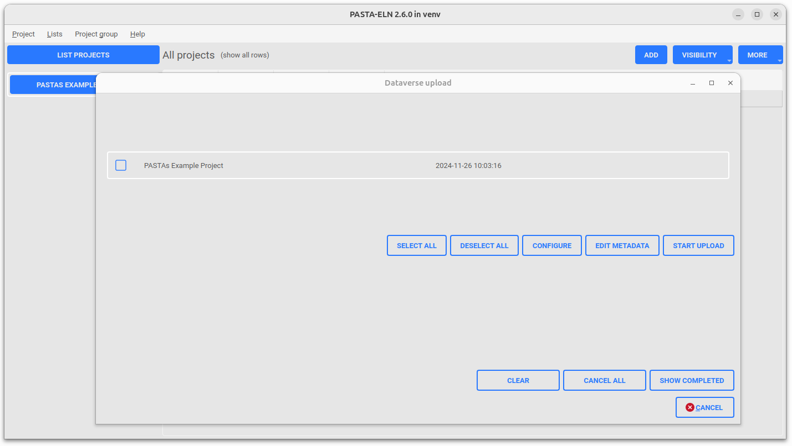
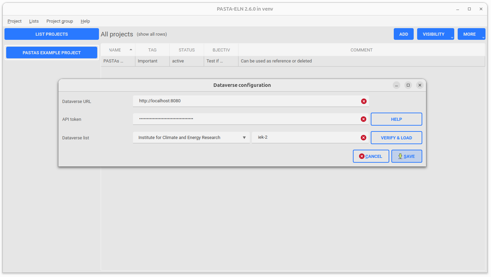
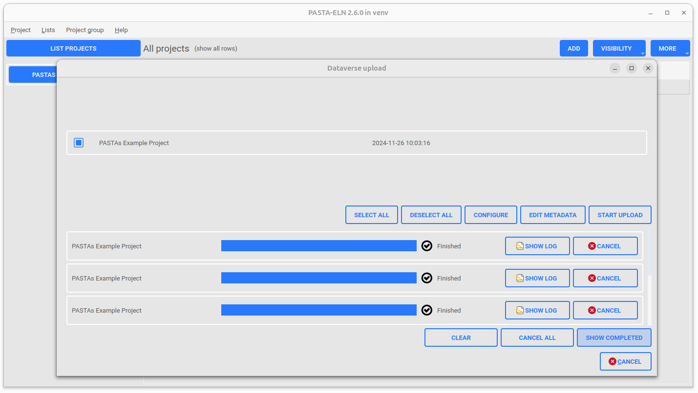
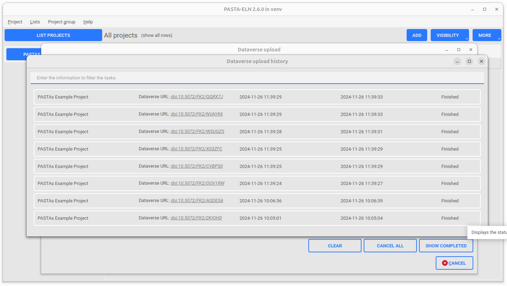
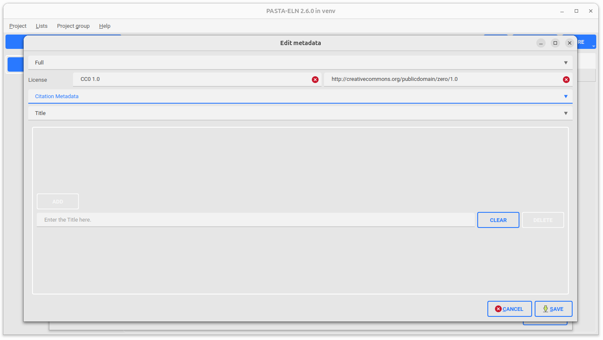

.. |DataverseUploadConfigurationUI| image:: _static/dataverse_upload_config.png
  :width: 700
  :alt: Dataverse metadata editor UI Screenshot.

Dataverse Integration
*********************

|DataverseUploadUI|

Dataverse integration feature enables user to publish the PASTA projects on the `Dataverse platform <https://dataverse.org/>`_. The feature allows the user to configure a particular dataverse instance on which the projects will be published. The dataverse instance can be configured in the user preferences.

The main intend behind this integration is to bring data `FAIR-ness <https://dataverse.org/presentations/fair-data-management-and-fair-data-sharing>`_ in the PASTA Application and to provide a way for users to make their data available to other researchers.

PASTA projects will be packaged as part of the ELN file and uploaded to the dataverse instance. User can configure the number of parallel uploads and the number of items to be packaged as part of the ELN file. Also the user can configure the metadata used for the creation of datasets in the dataverse instance. Once the required configuration is done, the user can start uploading the PASTA projects to the dataverse instance. There is also a possibility to upload multiple projects at a time. Make sure to configure at least the minimal set of metadata (subject, author, dataset contact & dataset description) required for the dataverse upload. Otherwise the upload will lead to an appropriate error message.

An individual upload process will be composed of the following steps:

- *Generate ELN file for the project*
- *Create a dataset in dataverse*
- *Publish the dataset in dataverse with the metadata configured by the user*
- *Upload the ELN file to the published dataset*

The following features are available as part of the dataverse integration:

- **Dataverse Configuration UI**: The user can configure the dataverse instance (server url, api token and dataverse id) on which the projects will be published. The screen capture of the dataverse Configuration UI |DataverseConfigurationUI|
- **Dataverse Upload UI**: The main UI where the user can upload the PASTA projects to the dataverse instance. The screen capture of the dataverse UI |DataverseUploadMainUI|
- **Dataverse Upload History UI**: The user can view the history of the uploaded projects to the dataverse instance. The screen capture of the dataverse upload history UI |DataverseUploadHistoryUI|
- **Dataverse Metadata Editor UI**: The user can edit the metadata used for the creation of datasets in dataverse which are associated with the PASTA projects. The screen capture of the dataverse upload history UI |DataverseMetadataEditorUI|
- **Dataverse Upload Configuration UI**: The user can define the configuration parameters (number of parallel uploads, items to pe packaged as part of the ELN file etc. ) used for dataverse upload. The screen capture of the dataverse upload history UI |DataverseUploadConfigurationUI|

Upload Usage
=============

Inorder to open the dataverse upload tool, follow the below given steps:

- Run the PASTA Application
- Go to **Project group | Upload to dataverse** or press **F11**
- An upload dialog will be opened with the loaded PASTA projects

|DataverseUploadUI|

- For the detailed user manual, please refer the document below

.. raw:: html

    <object width="700" height="400" type="application/pdf" data="_static/Dataverse_Integration_Manual.pdf?#zoom=50&scrollbar=0&toolbar=1&navpanes=0">
        
Failed to display the user manual, <a href = "_static/Dataverse_Integration_Manual.pdf">Click here to download the document.</a>

    </object>

.. _repositories:

Saving data to repositories
===========================

Zenodo
------

How to get an API key from Zenodo?

1. Go to Zenodo.
2. Log in or create an account.
3. Navigate to Applications under your user settings.
4. Generate a new Personal Access Token with deposit:write and deposit:actions permissions.
5. Copy-paste the key into the configuration

There are two instances of Zenodo

- Main instance: https://zenodo.org
- Testing instance: https://sandbox.zenodo.org

Zenodo typically requires this metadata:

- *title* (string): defaults to the project title
- *creators* (list of dicts: name, affiliation, orcid): defaults to the list of authors
- *description* (string): defaults to the project objective
- *keywords* (list of strings): defaults to the tags of this project
- *additional keys* (dict): additional information
- publication_date (YYYY-MM-DD): is today
- upload_type (string, e.g. "dataset", "publication", etc.): is "dataset"
- access_right (e.g. "open", "embargoed", "restricted", "closed"): is "open"
- license (e.g. "CC-BY-4.0"): is "CC-BY-4.0"
- related_identifiers (list of dicts: identifier, relation, resource_type): is empty

The research domain can be encoded in:

 - "keywords": ["machine learning", "neuroscience", "data science"]
 - "communities": [{"identifier": "neuroscience"}]

Dataverse
---------

How to get an API key from Dataverse?

1. Go to your Dataverse instance
2. Log in
3. Navigate to "API Token" under your user settings (top-right).
4. Generate a new Token.
5. Copy-paste the key into the configuration

Oftentimes there are two instances of Dataverse: the main one and one for testing.

Dataverse requires this metadata:

- *title* (string): defaults to the project title
- *author* (string): defaults to the list of authors
- *datasetContact* (string): defaults to the one in the list of authors
- *dsDescription* (string): defaults to the project objective
- *keyword* (list): defaults to the tags of this project
- *subject* (choice): At least one subject from a controlled vocabulary
- relatedPublications: is empty

Comparison Zenodo and Dataverse terms
-------------------------------------

.. csv-table::
   :widths: 30, 70
   :header-rows: 1

   Zenodo, Dataverse
   author,	creators
   datasetContact,	Not required (optionally in creators or omitted)
   dsDescription,	description
   subject	keywords, communities (approx.)
   keyword,	keywords
   publicationDate,	publication_date
   license (from termsOfUse),	license
   language,	language
   series,	No direct match
   relatedPublications,	related_identifiers
   productionDate,	No direct match
   depositor (internal use),	Not explicitly captured
   distributor,	No direct match
   software (if included),	upload_type = software or related_identifiers
   notesText,	description (as additional info)
   fileDescription,	File-level metadata (manually added in Zenodo)
   geographicCoverage,	No direct match (can go in description or keywords)
   temporalCoverage,	No direct match
   dataSources,	description (or none)
   methods,	description (or none)
