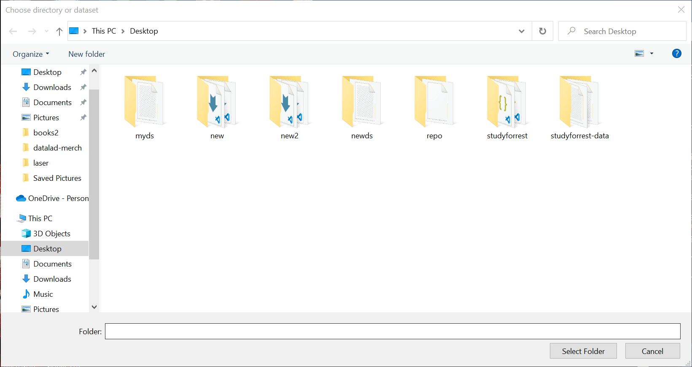
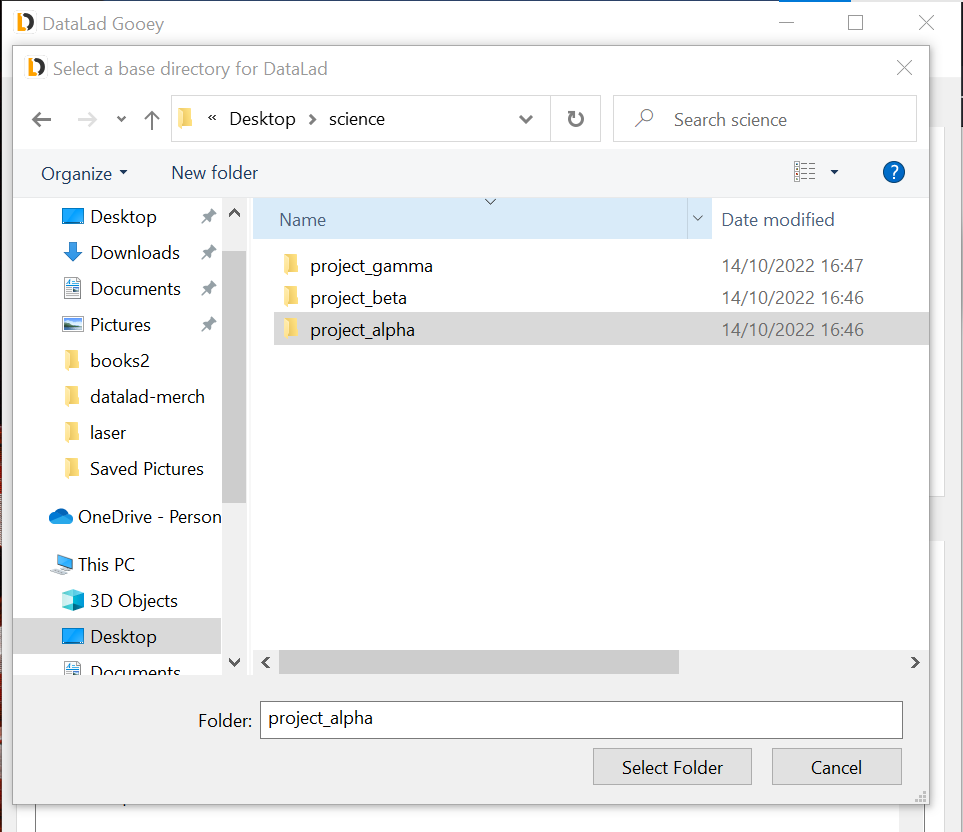
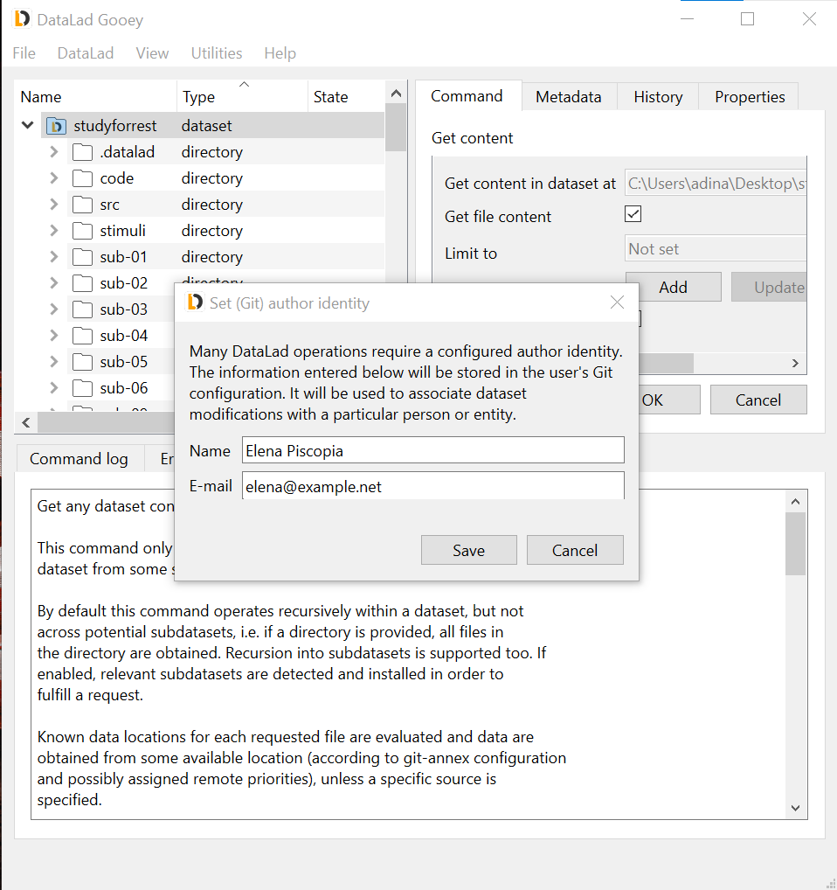
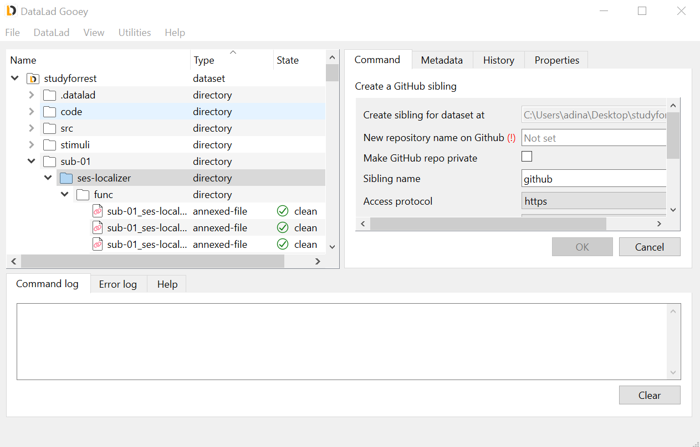
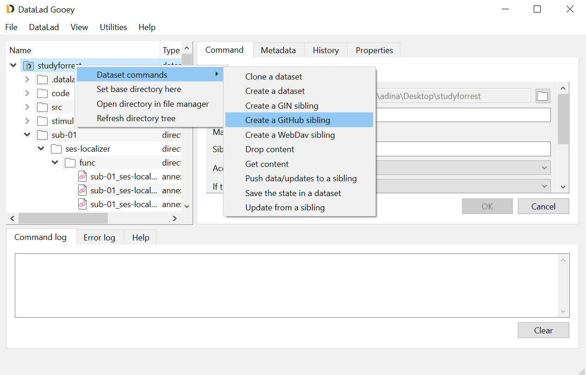
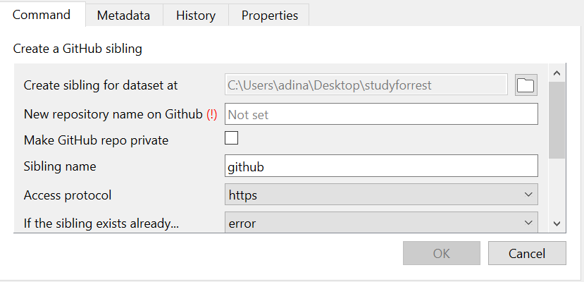
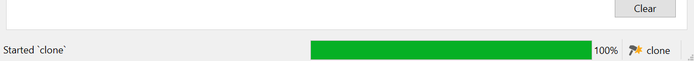
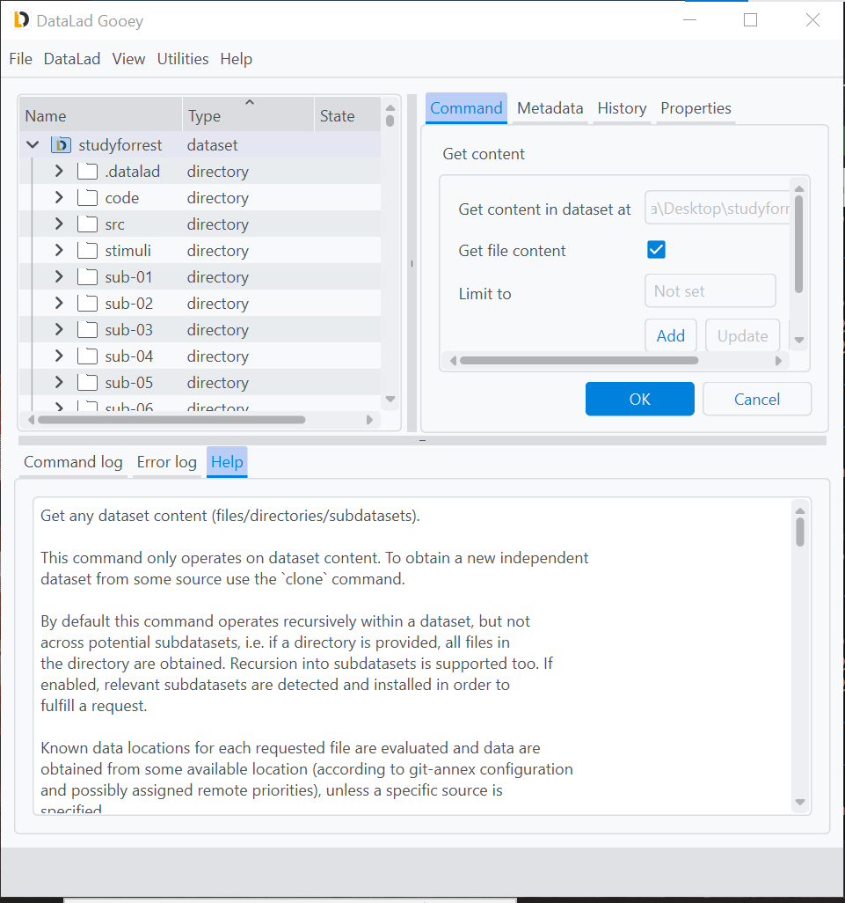
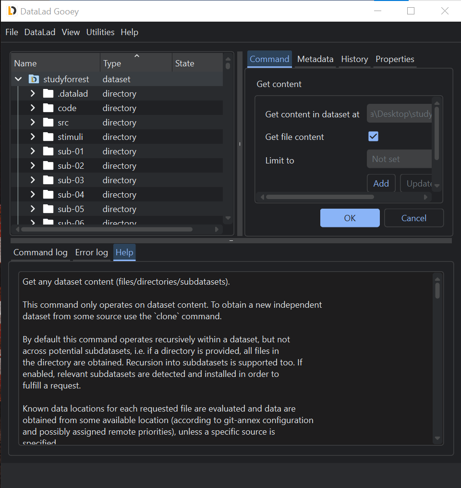
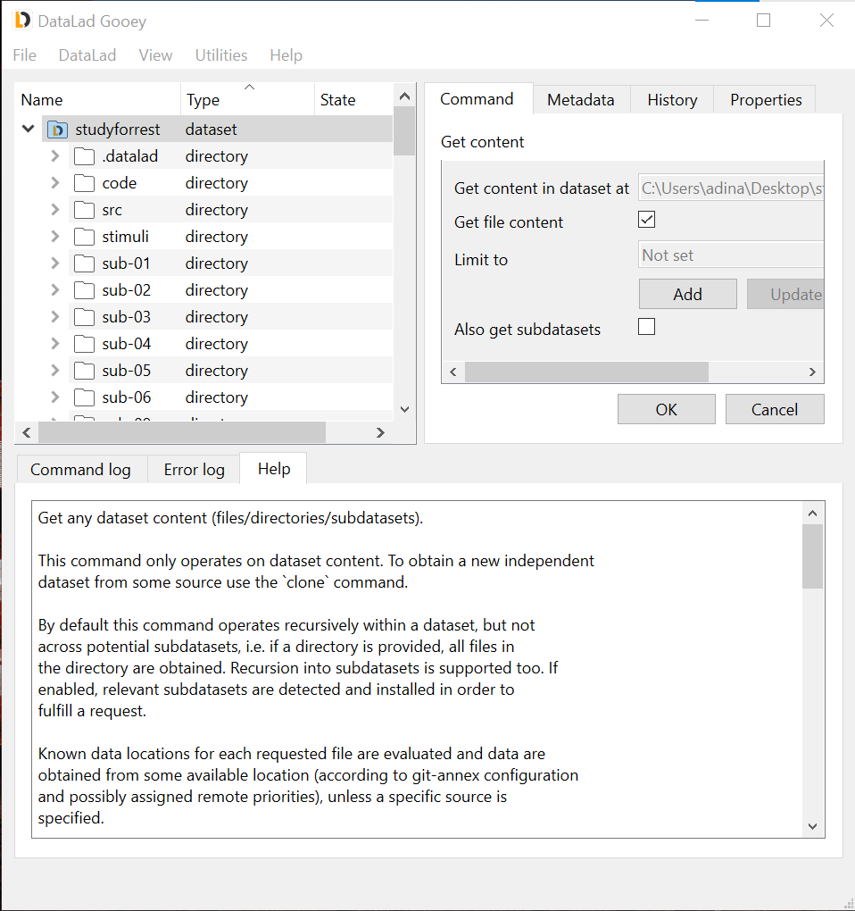

Getting started
###############

This section walks through the first steps to take when using ``DataLad Gooey`` and describes its main pieces and functions.

In order to start up ``DataLad Gooey``, double-click the program's icon on your Desktop or in your Explorer if you are on Windows, find it among your Desktop files if you are using Linux, or launch it from the Terminal if you are on Mac [#f1]_.
An initial dialog lets you select a base directory.
Navigate to any directory you would like to open up, select it, and click ``Select Folder``.

If you ``Cancel`` this dialog, the DataLad Gooey will open your home directory.
The root directory can be changed at any later point using the ``File`` → ``Set base directory`` submenu from the top task bar, or from the right-click context menus of directories in the file tree.

Initial configuration
---------------------

If you are using DataLad and Git for the first time on your computer, make sure that the first thing you do is to set your Git identity by clicking ``Utilities`` → ``Set author identity`` in the tab at the top of the application.
Add your name and email address in the resulting dialog.
This information will be used to include author information to the commands you will be running, and is required for many commands.

Application Overview
--------------------

The User Interface
^^^^^^^^^^^^^^^^^^

In general, the DataLad Gooey interface has three main sections: A tree view on the upper left, pane on the upper right containing ``Command``, ``Metadata``, ``History``and ``Properties`` tabs, and the different log views at the bottom.

The tree view should display files and directories on your computer, starting from the root directory picked at start up.
Double-clicking directories allows you to expand their contents, and to navigate into directory hierarchies.
Double-clicking files will attempt to open them in your systems configured default application.
You will notice that the ``Type`` and ``State`` annotations next to the file and directory names reveal details about files and directories:
You can distinguish directories and DataLad datasets and files.
Within datasets, files are either ``annexed-file``'s or ``file``'s, depending on how these files are tracked in the dataset.
The ``State`` property indicates the version-state of files, datasets, or directories: A new file, for example, would be annotated with an ``untracked`` state, a directory with a newly added unsaved change would be ``modified``, and neatly saved content would be annotated with a ``clean`` tag.

In addition to the information in the tree view, the ``Properties`` and ``History`` tab will load information for any selected directory or file.
The ``History`` tab displays past commits associated with the file or directory, and the ``Properties`` tab displays known information such as the annex key or file size of annexed files.

Running a DataLad command
^^^^^^^^^^^^^^^^^^^^^^^^^

There are two ways of running DataLad command: either through the ``Dataset`` menu at the top, or by right-clicking on files, directories, or datasets in the tree view.
The latter option might be simpler to use, as it only allows commands suitable for the item that was right-clicked on, and prefills many parameter specifications.
The screenshot below shows the right-click context menu of a dataset, which has more available commands than directories or files.

Once a DataLad command is selected, the ``Command`` tab contains relevant parameters and configurations for it.
The parameters will differ for each command, but hovering over their submenus or editors will show useful hints what to set them to, and the ``Help`` tab below displays the commands detailed documentation.
Little system-specific icons in the command panel can help you identify required input, or parameters that were wrongly specified (see detailed screenshot on the right).

Once input validation passes on all parameters, the ``OK`` button will become functional and will execute the command.
The ``Command log`` will continuously update you on the state of running and finished commands, displaying, where available, progress bars, result reports, or command summaries.

.. image:: _static/screenshots_overview/gooey-command-log.png
   :alt: Command log of a successful clone command

During command execution, a small hammer symbol lets you interrupt ongoing commands. If you accidentally started to ``get`` hundreds of Gigabytes worth of files instead of only one directory, clicking this button will stop the command.

.. note::

   The stop button will stop the execution at the next possible chance, which is after the next part of the command (such as the retrieval of the next file) has finished. This means it is not an immediate stop like a ``CTRL-C`` press in the command line, but a safe interruption. This also means that stopping might take longer than you expect, depending on the command that gets interrupted.

Should a command fail, a detailed traceback with details about the failure will be send to the ``Error log`` tab right next to the ``Command log``.
You can use the information from this tab to investigate and fix problems.

Navigation
^^^^^^^^^^

The interface can be navigated via mouse clicks, or, on most operating systems, via keyboard shortcuts as well.
Low lines under specific letters of menus or submenus identify the shortcut [#f2]_. Accessing the shortcut to a menu requires pressing ``Alt`` and the respective letter: ``Alt`` + ``f`` for example will open the ``File`` menu. Pressing further letters shortcuts to submenu actions: ``Alt`` + ``f`` + ``q`` will shortcut to ``Quit`` and close the application, while ``Alt`` + ``d`` + ``g`` will open a ``get`` command in the Command panel.

In addition, path parameters (such as the ``dataset`` parameter) can be filled via drag and drop from your system's native file browser.

The View Menu
^^^^^^^^^^^^^

The ``View`` menu contains two submenus that allow you to alter the appearance of the interface.
Whenever you change the appearance of the interface, you need to close and reopen the program in order to let the change take effect.

The ``Theme`` submenu lets you switch between a light, dark, and system theme, shown below in order.

The ``Suite`` submenu lets you switch between suites that alter the command selection.
The two suites you will always be able to select between is a "simplified" command set, reduced to the most essential commands and parameters, and a "complete" command set, which is a development preview.
DataLad extensions can add additional suites when you install them.
Please note that we recommend the "simplified" command suite to users, as the complete suite can contain experimental implementations.

The Utilities and Help Menu
^^^^^^^^^^^^^^^^^^^^^^^^^^^

The ``Utilities`` menu has a several useful functions.
One is a convenience version checker that can tell you whether there is a newer DataLad version available.

.. note::

   The ``Check for new version`` feature requires a network connection.

The ``Manage credentials`` submenu opens an interface to the Credential manager. The section :ref:`credentials` has a detailed overview.
The ``Set author identity`` submenu lets you set and change your Git identity and was already covered above.

The ``Help`` menu contains a range of actions to find additional information or help.
``Report a problem`` contains links for filing issues and getting in touch with the developers.
``Diagnostic infos`` will create a report about the details of your installation and system that you can copy-paste into such issues.

.. [#f1] Regardless of the operating system you are using, if you used ``pip`` to install ``datalad gooey`` you can also start it up from the command line, running ``datalad gooey``. The optional ``--path`` argument lets you specify the root directory.

.. [#f2] Windows users may not automatically see underlined letters. To make them visible, press the ``Alt`` key. Mac users won't see underlined letters as it would violate the guidelines of macOS graphical user interface `aqua <https://en.wikipedia.org/wiki/Aqua_%28user_interface%29>`_.
