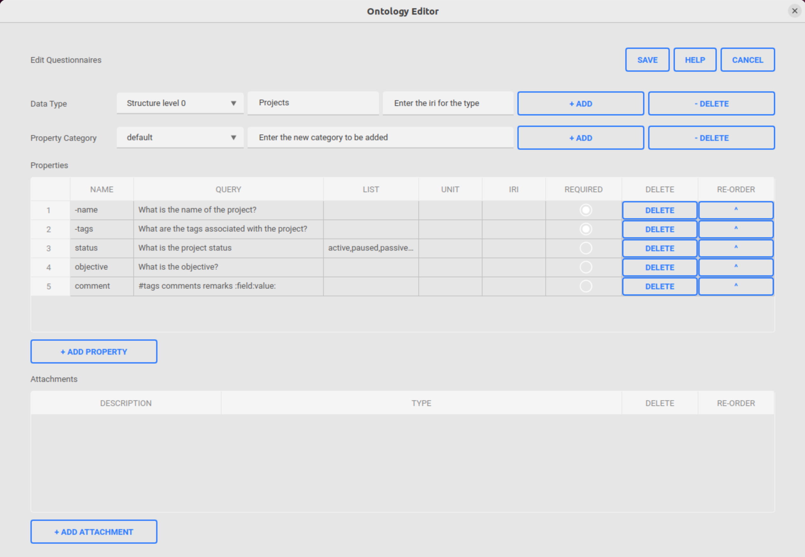
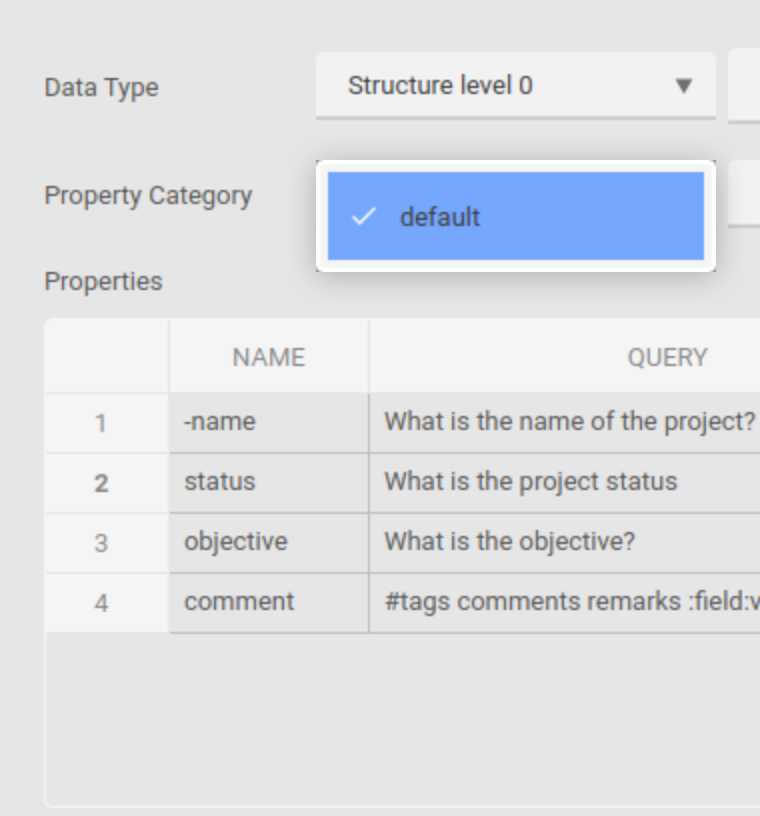

.. |TypesComboBox| image:: _static/types_combo_box.png
  :width: 200
  :alt: The screen capture of the types list in ontology editor main window

Ontology Configuration
**********************

Ontology editor tool allows the user to adapt the existing ontology in the database.
User can enter/edit two **types** in general using the tool:

- Structure level type for which the title is reserved (x0, x1, x2, ... xn) and cannot be used for normal types
- A generic type for which the title and label can be defined by the user without any restriction

Ontology editor tool displays all the available types in a combo list and user can select/add/delete the necessary one.

|TypesComboBox|

User can also select/add/delete a new property category associated with the selected type. Once selected, the properties from the category will be displayed in the properties table. A "default" category will always be present and the user can add new ones as needed.

|PropertyCategoryComboBox|

A property table is also displayed in UI which lists all the associated properties for the selected property category in UI for the respective type. Every category should contain two minimum required properties which are **-name** and **-tags**. If any category miss them, the save operation will not succeed prompting with an error message. Users can add as many as needed properties to the category.

For every type, there is also an associated attachment table shown in UI, which allows user to enter/delete new/existing associated attachment to the type.

Once when all the edits are done by the user, the changes can be saved by clicking the **save** button or to discard all the changes the **cancel** button can be used.

For more information, refer the user documentation attached below.

Usage
=====

Inorder to open the ontology tool, follow the below given steps:

- Run the PASTA Application
- Go to **System | Questionnaires** or press **F8**
- A ontology editor will be opened with the loaded data from the database as shown in the picture below

|EditorWindow|

- For the detailed user manual, please refer the document below

.. raw:: html

    <object width="700" height="400" type="application/pdf" data="_static/Ontology_Editor_Manual.pdf?#zoom=50&scrollbar=0&toolbar=1&navpanes=0">
        
Failed to display the user manual, <a href = "_static/Ontology_Editor_Manual.pdf">Click here to download the document.</a>

    </object>
